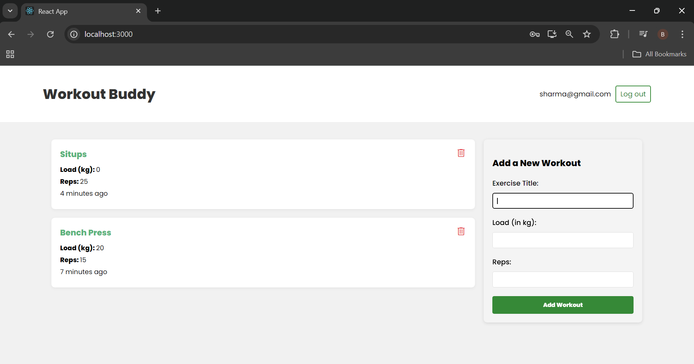

## 🏋️ Workout Buddy — A MERN Stack Fitness Tracker

Workout Buddy is a full-stack web application that helps users log and manage their workout routines.

#### Features

User Authentication: Sign up, login, logout with JWT
Workout Management: Add, delete, and view logged workouts
MongoDB Atlas: Cloud-hosted NoSQL database
RESTful API with Express.js
Responsive UI with React
Deployed on Vercel (frontend) & Render (backend)

